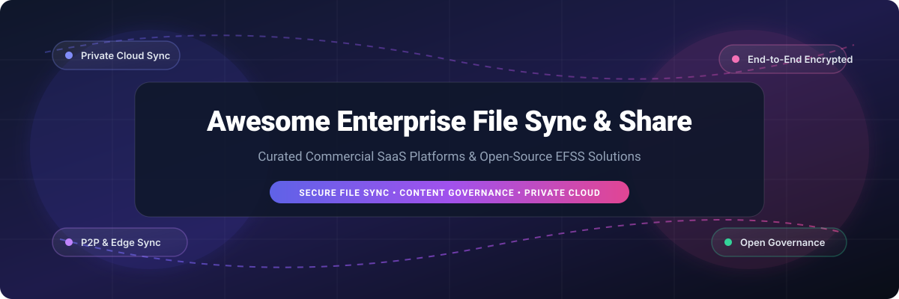

  
  
  
  

# 🚀 Top Enterprise File Sync & Share (EFSS) Ecosystem

Curated Directory of Commercial SaaS Platforms & Open-Source Projects for Enterprise File Sync & Share (EFSS), Secure Content Collaboration, Zero-Trust Storage, and Private Cloud Infrastructure.

---

## 📌 Table of Contents
- [📖 Overview & SEO Keywords](#-overview--seo-keywords)
- [☁️ Enterprise SaaS & Hosted Platforms](#️-enterprise-saas--hosted-platforms)
- [🔓 Open-Source GitHub Projects](#-open-source-github-projects)
- [🛠️ Storage, Security & Identity Infrastructure](#️-storage-security--identity-infrastructure)
- [🤝 How to Contribute](#-how-to-contribute)
- [💖 Support & Community](#-support--community)
- [📈 Star History](#-star-history)
- [⚖️ Disclaimer](#️-disclaimer)

---

## 📖 Overview & SEO Keywords

This repository provides a comprehensive market landscape of **Enterprise File Sync and Share (EFSS)** solutions, **Managed File Transfer (MFT)** tools, **Zero-Trust Encrypted Storage**, and **Self-Hosted Private Cloud Collaboration** ecosystems.

Whether you are evaluating commercial cloud providers like Microsoft 365 or Box, or engineering a compliance-ready on-premises platform with Nextcloud, MinIO, and Keycloak, this guide covers deployment options, transparent starting pricing, free trial limits, enterprise market size, and open-source star metrics.

---

## ☁️ Enterprise SaaS & Hosted Platforms

📊 **Market Size & Industry Structure:** The global Enterprise File Sync & Share (EFSS) market is estimated at **\$11.8 Billion to \$14.5 Billion** (expanding at a ~22% CAGR). The market is **moderately fragmented**: mega-cloud hyperscalers (Microsoft 365, Google Workspace) control the baseline market share for standard office collaboration, while specialized enterprise vendors (Box, Egnyte, Kiteworks, ShareFile, NetApp) command high-margin enterprise accounts by offering zero-trust security, DLP integration, hybrid edge synchronization, and strict governance control.

*Note: Platforms below are sorted by **Company Size / Revenue / Market Capitalization** in descending order.*

| 🏢 Platform / SaaS Product | 📈 Company Size / Revenue / Valuation | 💰 Starting Pricing Tier | 🎁 Free Forever Plan / Free Trial Limits | 📝 Primary Focus & Enterprise Features |
| :--- | :--- | :--- | :--- | :--- |
| **[Microsoft OneDrive for Business](https://www.microsoft.com/en-us/microsoft-365/onedrive/online-cloud-storage)** / **[SharePoint](https://www.microsoft.com/en-us/microsoft-365/sharepoint/collaboration)** | \$3.1 Trillion Market Cap / ~\$245 Billion Revenue | \$5.00 / user / month *(OneDrive Plan 1)* | 30-day free trial *(25 seats, 1 TB / user)* or 5 GB personal free account | Deep Microsoft 365, Teams & Entra ID integration, compliance governance, automated workflows. |
| **[Google Drive](https://workspace.google.com/products/drive/)** / **[Google Workspace](https://workspace.google.com)** | \$2.1 Trillion Market Cap / ~\$307 Billion Revenue | \$6.00 / user / month *(Business Starter)* | 14-day free trial *(15 GB storage / user)* or 15 GB personal free storage | Cloud-native real-time document editing, Docs/Sheets/Slides, enterprise admin control. |
| **[NetApp BlueXP](https://bluexp.netapp.com/)** | \$24.0 Billion Market Cap / ~\$6.3 Billion Revenue | \$0.10 / GB / month *(Payload Pay-as-you-go)* | 30-day free evaluation trial *(up to 500 GB payload capacity)* | Hybrid multicloud data management, edge file synchronization, and high-performance cloud storage. |
| **[OpenText Core Share](https://www.opentext.com/products/core-share)** / **[Hightail](https://www.hightail.com/)** | \$8.5 Billion Market Cap / ~\$5.8 Billion Revenue | \$12.00 / user / month *(Core Share / Pro)* | 30-day free trial *(25 GB storage)* or 2 GB free Lite account | Enterprise content collaboration, governance, controlled external sharing, and heavy file delivery. |
| **[Dropbox Business](https://www.dropbox.com/business)** / **[Dropbox Enterprise](https://www.dropbox.com/enterprise)** | \$8.5 Billion Valuation / ~\$2.5 Billion Revenue | \$15.00 / user / month *(Essentials Plan)* | 30-day free trial *(3 TB team workspace storage)* or 2 GB free personal account | Seamless cross-platform file synchronization, team spaces, electronic signatures, and admin auditing. |
| **[Citrix ShareFile](https://www.sharefile.com/)** / **Content Collaboration** | ~\$13.0 Billion Valuation *(CSG Parent)* / ~\$700 Million ARR | \$10.00 / user / month *(ShareFile Premium)* | 30-day free trial *(25 GB storage, unlimited transfer bandwidth)* | Regulated industry file exchange, legal/financial client portals, e-signatures, and custom branding. |
| **[Box](https://www.box.com/)** | \$4.2 Billion Market Cap / ~\$1.04 Billion Revenue | \$15.00 / user / month *(Business Plan)* | 14-day free trial *(100 GB limit, 5 GB max file size)* or 10 GB free individual plan | Enterprise content management, automated workflows, DLP, enterprise key management (EKM), and AI indexing. |
| **[Egnyte](https://www.egnyte.com/)** | ~\$1.6 Billion Valuation / ~\$200 Million ARR | \$20.00 / user / month *(Office Plan)* | 15-day free trial *(1 TB storage quota for up to 10 users)* | Hybrid cloud file locking, content governance, threat detection, and AEC/life science compliance. |
| **[Kiteworks](https://www.kiteworks.com/)** | ~\$1.2 Billion Valuation / ~\$150 Million ARR | \$15.00 / user / month *(Business Tier)* | 14-day free trial *(10 GB transfer quota / 5 users maximum)* | Hardened private content network, MFT, automated email protection, CMMC & FedRAMP compliance. |
| **[Nasuni](https://www.nasuni.com/)** | ~\$1.2 Billion Valuation / ~\$120 Million ARR | \$14.00 / user / month *(Enterprise equivalent)* | 30-day enterprise evaluation trial *(full feature access)* | Cloud-native global file system, rapid ransomware recovery, and edge caching appliance integration. |
| **[Zoho WorkDrive](https://www.zoho.com/workdrive/)** | ~\$10.0+ Billion Parent *(Zoho Corp)* / ~\$20 Million ARR | \$2.50 / user / month *(Starter Plan - 1 TB/user)* | 15-day free trial *(1 TB shared team storage)* or 5 GB free personal account | Shared team folders, desktop sync, granular permission roles, and native Zoho Office Suite integration. |
| **[Syncplicity](https://www.axway.com/en/products/syncplicity)** *(Axway)* | ~\$800 Million Axway Cap / ~\$40 Million ARR | \$6.00 / user / month *(Business Tier)* | 30-day free trial *(100 GB total storage for up to 3 users)* | Secure mobile file access, real-time file replication, hybrid storage connectors, and policy enforcement. |
| **[Ctera](https://www.ctera.com/)** | ~\$500 Million Valuation / ~\$80 Million ARR | \$18.00 / user / month *(Enterprise Drive)* | 30-day evaluation trial *(up to 1 TB virtual storage)* | Edge-to-cloud file services, zero-trust file sync, branch office caching, and multi-tenant management. |
| **[Files.com](https://www.files.com/)** | ~\$50 Million ARR *(Private)* | \$10.00 / user / month *(Standard Plan)* | 7-day free trial *(50 GB storage capacity)* | Managed File Transfer (MFT), automated B2B integrations, SFTP/WebDAV/S3 endpoint bridging. |
| **[LucidLink](https://www.lucidlink.com/)** | ~\$75 Million Valuation / ~\$30 Million ARR | \$12.00 / user / month + \$20.00 / TB / month | 14-day free trial *(100 GB free cloud storage included)* | High-performance streaming file system designed for real-time video editing and massive media workflows. |
| **[Tresorit](https://tresorit.com/)** | ~\$30 Million ARR *(Swiss Post Subsidiary)* | \$14.50 / user / month *(Business Standard)* | 14-day free trial *(1 TB zero-knowledge encrypted storage)* | Zero-knowledge end-to-end encryption, Swiss privacy protection, and secure client file request links. |
| **[Nextcloud Enterprise](https://nextcloud.com/enterprise/)** | ~\$25 Million ARR *(Nextcloud GmbH)* | €36.00 / user / year *(~\$3.25 / user / month)* | Community Edition **100% Free Forever** *(unlimited)* or 60-day Enterprise trial | Self-hosted private cloud with enterprise SLAs, custom branding, migration assistance, and security audit support. |
| **[FileCloud](https://www.filecloud.com/)** *(CodeLathe)* | ~\$25 Million ARR *(Private)* | \$4.50 / user / month *(Standard Essentials)* | 14-day free trial *(unlimited storage and users during trial)* | Self-hosted or cloud file sharing, hyper-secure governance, metadata management, and SIEM integration. |
| **[Sync.com](https://www.sync.com/)** | ~\$20 Million ARR *(Private)* | \$6.00 / user / month *(Teams Standard)* | **5 GB Free Forever Plan** *(1 user account)* | End-to-end zero-knowledge encrypted cloud storage, HIPAA compliance, and secure password sharing. |
| **[pCloud Business](https://www.pcloud.com/business.html)** | ~\$15 Million ARR *(Private)* | \$7.99 / user / month *(Business Pro)* | **10 GB Free Forever Plan** *(individual)* or 30-day business trial | Swiss data protection, client-side encryption options, virtual hard drive sync, and file versioning. |
| **[MASV](https://mcsv.io/)** | ~\$15 Million ARR *(Private)* | \$0.25 / GB downloaded *(Pay-as-you-go)* | 7-day free trial *(20 GB free transfer credit)* | Accelerated large-file transport protocol for creative video post-production and heavy asset delivery. |
| **[SpiderOak Crossclave](https://spideroak.com/)** | ~\$10 Million ARR *(Private)* | \$6.00 / user / month *(Crossclave Basic)* | 21-day free trial *(5 GB secure space)* | No-knowledge secure file sharing, zero-trust architecture, and space-grade cryptographically secure sync. |
| **[Filecamp](https://filecamp.com/)** | ~\$5 Million ARR *(Private)* | \$29.00 / month flat *(Business - up to 20 users)* | 30-day free trial *(20 GB storage limit, unlimited trial users)* | Digital Asset Management (DAM) & file sharing with custom white-label branding, proofing, and tagging. |

---

## 🔓 Open-Source GitHub Projects

Below is a curated collection of self-hosted, community-driven, and open-source file synchronization, sharing, and private cloud projects.

*Note: Repositories are sorted by **GitHub Star Count** in descending order.*

### ⚡ Primary File Sync & Collaboration Platforms

- 🔄 **[Syncthing](https://github.com/syncthing/syncthing)**  — Decentralized, peer-to-peer continuous continuous file synchronization system that syncs directly between devices without central servers.
- ⚡ **[MinIO](https://github.com/minio/minio)**  — High-performance S3-compatible object storage layer commonly deployed beneath enterprise EFSS collaboration engines.
- 🧰 **[rclone](https://github.com/rclone/rclone)**  — "rsync for cloud storage" - versatile CLI engine supporting bi-directional sync across 70+ cloud backends.
- ☁️ **[Nextcloud Server](https://github.com/nextcloud/server)**  — Comprehensive open-source private cloud productivity suite with file sync, sharing, video calls, calendars, and office editing.
- 📁 **[File Browser](https://github.com/filebrowser/filebrowser)**  — Lightweight self-hosted web-based file manager providing fast file management, user management, and download links.
- 🌩️ **[Cloudreve](https://github.com/cloudreve/Cloudreve)**  — Modern self-hosted cloud drive system supporting local storage, S3, OSS, COS, OneDrive, and remote download tasks.
- 🗄️ **[Filestash](https://github.com/mickael-kerjean/filestash)**  — Web-based frontend client connecting to S3, SFTP, WebDAV, Git, MinIO, and FTP servers.
- 🔀 **[PairDrop](https://github.com/schlagmichdoch/pairdrop)**  — Local peer-to-peer file transfer system running entirely in web browsers (AirDrop alternative).
- ✉️ **[Send (Mozilla Send Fork)](https://github.com/timvisee/send)**  — End-to-end encrypted file sharing app with self-destructing links and download caps.
- 🐧 **[Pingvin Share](https://github.com/stonith404/pingvin-share)**  — Privacy-focused self-hosted file sharing platform with custom link expiration, passwords, and reverse proxy support.
- 🖼️ **[Chibisafe](https://github.com/chibisafe/chibisafe)**  — Modern self-hosted file uploader and link generator with tag management and album support.
- 📦 **[Pydio Cells](https://github.com/pydio/cells)**  — Golang-based enterprise document sharing and collaboration platform designed for microservices architecture.
- ♾️ **[ownCloud Infinite Scale (oCIS)](https://github.com/owncloud/ocis)**  — Cloud-native file sync and share engine built in Go with microservice architecture and WebDAV CS3 APIs.
- 📤 **[PsiTransfer](https://github.com/psi-im/psitransfer)**  — Simple, zero-configuration open-source file transfer solution for large files.
- 🔗 **[Sharry](https://github.com/eikek/sharry)**  — Self-hosted web application for uploading and sharing files with password protection and expiration dates.
- 🛋️ **[Cozy Stack](https://github.com/cozy/cozy-stack)**  — Personal cloud platform server aggregating personal data, document synchronization, and app integration.
- 🌐 **[OpenCloud](https://github.com/opencloud-eu/opencloud)**  — Modern European open-source cloud file management and enterprise collaboration platform.
- 🌊 **[Seafile Server](https://github.com/haiwen/seafile-server)**  — High-performance file sync engine focusing on fast block-based sync, library encryption, and drive mounting.

---

## 🛠️ Storage, Security & Identity Infrastructure

Below are adjacent open-source components that form a production-grade, highly-available enterprise EFSS stack when combined with a collaboration engine:

| Component Category | Repository / Tool | Stars | Role in EFSS Architecture |
| :--- | :--- | :--- | :--- |
| **Workflow Automation** | **[Apache Airflow](https://github.com/apache/airflow)** |  | Orchestrating content lifecycle pipelines, scheduled archival, and compliance jobs. |
| **Event Streaming** | **[Apache Kafka](https://github.com/apache/kafka)** |  | Asynchronous audit logs, real-time sync notification distribution, and file upload event buses. |
| **Identity & IAM** | **[Keycloak](https://github.com/keycloak/keycloak)** |  | Centralized SSO, SAML 2.0, OpenID Connect, and enterprise directory integration. |
| **Distributed Storage** | **[SeaweedFS](https://github.com/seaweedfs/seaweedfs)** |  | Fast distributed blob and file system backend for storing millions of small/large files. |
| **Identity Provider** | **[Authentik](https://github.com/authentik/authentik)** |  | Flexible open-source identity provider for user access control, MFA, and OAuth 2.0. |
| **Document Suite** | **[ONLYOFFICE Docs](https://github.com/ONLYOFFICE/DocumentServer)** |  | Collaborative online document editing server compatible with Nextcloud, ownCloud, and Seafile. |
| **Enterprise Storage** | **[Ceph](https://github.com/ceph/ceph)** |  | Unified, distributed storage system providing object (RADOS/S3) and block storage. |
| **Search & Discovery** | **[OpenSearch](https://github.com/opensearch-project/OpenSearch)** |  | Distributed search engine for full-text document search and audit log analytics. |
| **Policy Enforcement** | **[Open Policy Agent](https://github.com/open-policy-agent/opa)** |  | Fine-grained, unified policy enforcement for file access authorization and governance. |
| **Malware Security** | **[ClamAV](https://github.Cisco-Talos/clamav)** |  | Antivirus engine integrated into file-upload pipelines to block infected file sharing. |
| **Office Editing** | **[Collabora Online](https://github.com/CollaboraOnline/online)** |  | Enterprise-grade online office editor based on LibreOffice technology. |
| **Geo-Storage** | **[Garage Storage](https://github.com/garage-hq/garage)** |  | Lightweight S3-compatible distributed object storage for self-hosted multi-site clusters. |
| **Metadata Extraction**| **[Apache Tika](https://github.com/apache/tika)** |  | Content analysis toolkit for extracting text and metadata from 1000+ file types. |
| **Legacy Network Sharing**| **[Samba](https://github.com/samba-team/samba)** |  | Open-source SMB/CIFS file sharing services for heterogeneous enterprise networks. |

---

## 🤝 How to Contribute

Contributions are warmly welcome! Please follow these guidelines:

1. Fork this repository.
2. Add new platforms, open-source projects, or architectural building blocks in the appropriate section.
3. Keep descriptions technically accurate, neutral, and concise.
4. For SaaS solutions, ensure accurate starting pricing tiers and free trial parameters are included.
5. Submit a clean Pull Request with clear commit messages.

---

## 💖 Support & Community

If you find this curated ecosystem directory helpful, please consider showing your support:

- ⭐ **Star this repository** to help others discover it on GitHub.
- 🔀 **Fork & Share** with your fellow developers, DevOps teams, and sysadmins.
- ☕ **Sponsor / Buy me a coffee**: Support ongoing open-source curation and development via the [GitHub Sponsor Dashboard](https://github.com/sponsors/ishandutta2007).

---

## 📈 Star History

---

## ⚖️ Disclaimer

*This list is a curated ecosystem directory for educational and architectural evaluation purposes and does not represent an endorsement or financial ranking. SaaS features, pricing, and open-source project metrics change over time; always verify licensing, security compliance, and vendor SLAs prior to enterprise deployment.*

  Made with ❤️ for developers, infrastructure engineers, IT administrators, and privacy advocates. 
  Curated by <a href="https://github.com/ishandutta2007">Ishan Dutta</a> • Ecosystem powered by <a href="https://github.com/ishandutta2007/Awesome-Awesome-Awesome">Awesome-Awesome-Awesome</a>

